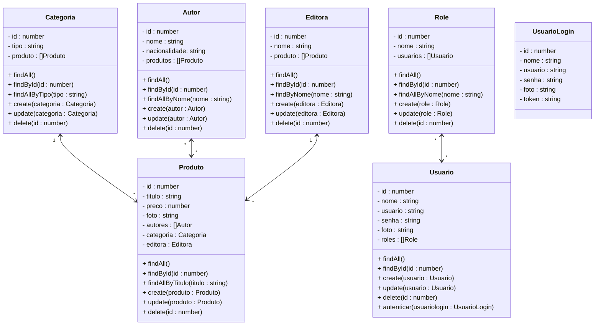

# Projeto Livraria - Backend

<br />

<div align="center">
    
</div>


<br /><br />

## 1. Descrição

O **Projeto Livraria** é uma **API REST** desenvolvida com **NestJS**, voltada para a gestão de uma livraria online. O sistema permite o gerenciamento de **produtos (livros), autores, editoras, categorias, usuários e permissões (roles)**.

A aplicação foi projetada para oferecer uma plataforma segura e eficiente para administração de catálogos de livros e gestão de usuários. O projeto possui integração com um frontend web e, futuramente, um aplicativo mobile para melhorar a experiência de compra e navegação.

<br />

### 1.1. Funcionalidades Principais:

1. Um catálogo de livros disponíveis
2. Funcionalidade de busca e filtragem de opções
3. Sistema de pedidos e pagamentos online
4. Rastreamento de entrega
5. Avaliações e feedback dos usuários

------

## 2. Sobre esta API

Esta API foi desenvolvida utilizando **NestJS** para criar a estrutura básica de um sistema de livraria. Ela fornece endpoints para gerenciar usuários (e suas permissões), produtos, autores, editoras e categorias.

<br />

### 2.1. Principais Funcionalidades

1. **Gerenciamento de Produtos**: Cadastro, leitura, atualização e exclusão de livros, com informações como título, preço, autor, editora e categoria.
2. **Gerenciamento de Autores**: Cadastro de autores e seus livros, associando-os aos produtos.
3. **Gerenciamento de Editoras**: Cadastro e vinculação de editoras aos produtos.
4. **Gestão de Categorias**: Organize os produtos em diferentes categorias para facilitar a navegação.
5. **Cadastro de Usuários**: Gerencie os perfis de clientes, com informações como nome, email e senha.
6. **Sistema de Roles (Permissões)**: Controle de acesso baseado em papéis (roles) para definir quais usuários podem acessar ou modificar recursos específicos.
7. **Autenticação com JWT**: Proteção de rotas com autenticação baseada em token JWT, garantindo a segurança e privacidade das informações.

------

## 3. Diagrama de Classes



------

## 4. Diagrama Entidade-Relacionamento (DER)


<div align="center">
    
</div>


------

## 5. Tecnologias utilizadas

| Item                          | Descrição  |
| ----------------------------- | ---------- |
| **Servidor**                  | Node JS    |
| **Linguagem de programação**  | TypeScript |
| **Framework**                 | Nest JS    |
| **ORM**                       | TypeORM    |
| **Banco de dados Relacional** | MySQL      |

------

## 6. Configuração e Execução

1. Clone o repositório:

   ```
   git clone https://github.com/usuario/livraria-backend.git
   ```
2. Acesse a pasta do projeto:

   ```
   cd livraria-backend
   ```

3. Instale as dependências:

   ```
   npm install
   ```

4. Crie o banco de dados `db_livraria` no MySQL

5. Crie o arquivo `.env` na pasta raiz do projeto
6. Configure a conexão com o banco de dados e a secret (chave de assinatura do token JWT), no arquivo `.env`, através das variáveis de ambiente abaixo:

```bash
DATABASE_HOST=localhost
DATABASE_PORT=3306
DATABASE_USER=seu_usuario
DATABASE_PASSWORD=sua_senha
DATABASE_NAME=db_livraria
JWT_SECRET=sua_chave_secreta
```

5. Execute a aplicação: `npm run start:dev`

------

## 7. Estrutura do Projeto

A estrutura do projeto foi organizada da seguinte forma:

```
src/
│
├── autor/             # Módulo de Autores
├── categoria/         # Módulo de Categorias
├── data/              # Configurações do banco de dados
├── editora/           # Módulo de Editoras
├── produto/           # Módulo de Produtos
├── role/              # Módulo de Roles
├── security/          # Módulo de autenticação
├── usuario/           # Módulo de Usuários
├── util/              # Funções auxiliares (ex: cálculos, conversores, entre outros)
└── app.module.ts      # Módulo principal da aplicação

```


------

## 8. Implementações Futuras

- [ ] **Avaliações de Produtos**: Implementar a função Curtir livros
- [ ] **Envio de E-mail**: Implementar notificações por e-mail para os usuários (ex.: confirmação de cadastro).