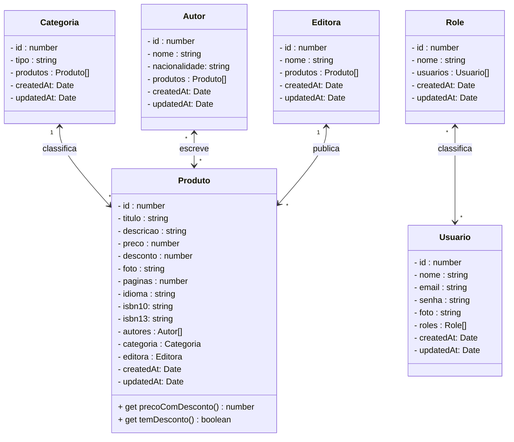
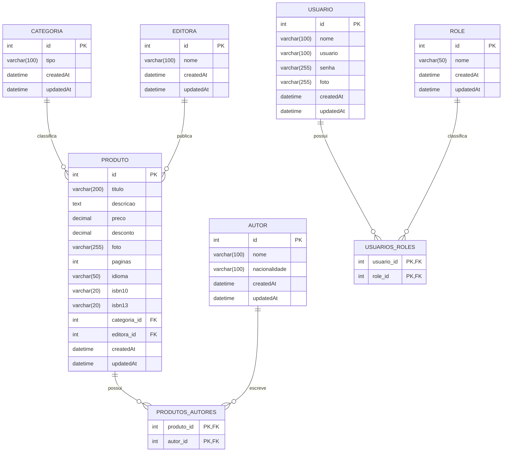

# Projeto Livraria - Backend Nest

<br />

<div align="center">
    
</div>
<br /><br />

<div align="center">
  
  
  
  
  
  
  
</div>

<br/>

## 1. Descrição

O **Projeto Livraria** é uma **API REST** desenvolvida com **NestJS**, voltada para a gestão de uma livraria online. O sistema permite o gerenciamento de **produtos (livros), autores, editoras, categorias, usuários e permissões (roles)**.

A aplicação foi projetada para oferecer uma plataforma segura e eficiente para administração de catálogos de livros e gestão de usuários. O projeto possui integração com um frontend web e, futuramente, um aplicativo mobile para melhorar a experiência de compra e navegação.

<br />

## 2. Sobre esta API

Esta API foi desenvolvida utilizando **NestJS** para criar a estrutura básica de um sistema de livraria, com o objetivo de consolidar e aprofundar os conhecimentos na construção de **APIs REST**, explorando boas práticas de arquitetura, segurança e organização de código.

<br />

### 2.1. Principais Funcionalidades

1. **Gerenciamento de Produtos**: Cadastro, leitura, atualização e exclusão de livros, com informações como título, preço, autor, editora e categoria.
2. **Gerenciamento de Autores**: Cadastro de autores e seus livros, associando-os aos produtos.
3. **Gerenciamento de Editoras**: Cadastro e vinculação de editoras aos produtos.
4. **Gestão de Categorias**: Organize os produtos em diferentes categorias para facilitar a navegação.
5. **Cadastro de Usuários**: Gerencie os perfis de clientes, com informações como nome, email e senha.
6. **Sistema de Roles (Permissões)**: Controle de acesso baseado em papéis (roles) para definir quais usuários podem acessar ou modificar recursos específicos.
7. **Autenticação com Token JWT**: Proteção de rotas com autenticação baseada em token JWT, garantindo a segurança e privacidade das informações.
8. **Upload de Imagens no ImageKit**: Armazenamento e otimização de imagens de produtos por meio da integração com o serviço ImageKit.
9. **Envio de E-mail de Confirmação no Cadastro do Usuário**: Disparo automático de e-mail de confirmação após o registro do usuário, promovendo segurança e verificação da conta.

<br />

## 3. Diagrama de Classes



<br />

## 4. Diagrama Entidade-Relacionamento (DER)




<br />

## 5. Tecnologias

| Item                          | Descrição           |
| ----------------------------- | ------------------- |
| **Servidor**                  | Node JS             |
| **Linguagem de programação**  | TypeScript          |
| **Framework**                 | Nest JS             |
| **ORM**                       | TypeORM             |
| **Banco de dados Relacional** | MySQL e PostgresSQL |
| **Testes**                    | Jest e Super Test   |

<br />

## 6. Configuração e Execução

1. Clone o repositório:

   ```
   git clone https://github.com/usuario/livraria-backend.git
   ```
2. Acesse a pasta do projeto:

   ```
   cd livraria-backend
   ```

3. Instale as dependências:

   ```
   npm install
   ```

4. Crie o banco de dados `db_livraria` no MySQL

5. Crie o arquivo `.env` na pasta raiz do projeto
6. Adicione as  variáveis de ambiente abaixo, no arquivo `.env`:

```bash
DATABASE_HOST=localhost
DATABASE_PORT=3306
DATABASE_USER=usuario_MySQL
DATABASE_PASSWORD=senha_MySQL
DATABASE_NAME=db_livraria
JWT_SECRET=sua_chave_secreta
BACKEND_URL=http://localhost:4000 ou endereço do deploy do Backend
FRONTEND_URL=http://localhost:5173 ou endereço do deploy do Frontend
EMAIL_USER= Endereço do Gmail válido (envio de e-mail automático)
EMAIL_PASSWORD= Senha de aplicativo do Gmail (https://myaccount.google.com/apppasswords)
IMAGEKIT_PRIVATE_KEY= Chave Privada da sua conta no imagekit (https://imagekit.io/)
IMAGEKIT_URL_ENDPOINT=https://upload.imagekit.io/api/v1/files/upload
IMAGEKIT_URL_DELETE=https://api.imagekit.io/v1/files
```

**IMPORTANTE:** Não utilize a senha de acesso a conta do Gmail, crie uma senha de aplicativo, através do link indicado ao lado.


7. Execute a aplicação, utilize o comando abaixo: 

```bash
npm run start:dev
```

8. Para executar os testes no Jest, utilize o comando abaixo:

```bash
#Execuata todos os testes
npm run test:e2e

#Executa uma classe de teste específica
npm run test:e2e nome_do_arquivo
```

<br />

## 7. Estrutura de pastas

A estrutura do projeto foi organizada da seguinte forma:

```
src/
│
├── autor/             # Módulo de Autores
├── categoria/         # Módulo de Categorias
├── data/              # Configurações do banco de dados
├── editora/           # Módulo de Editoras
├── imagekit/          # Módulo de integração com a API do Imagekit
├── produto/           # Módulo de Produtos
├── role/              # Módulo de Roles
├── security/          # Módulo de autenticação
├── types/             # Tipos de dados customizados
├── sendmail/          # Módulo de envio de e-mail
├── usuario/           # Módulo de Usuários
├── util/              # Funções auxiliares (ex: cálculos, conversores, entre outros)
└── app.module.ts      # Módulo principal da aplicação
│
test/
│
├── factories/         # Gerador de cenários de teste
├── helpers/           # Funções auxiliares
├── mocks/         	   # Mocks (simuladores) da aplicação
│					 # Arquivos de teste
```


<br />

## 8. Implementações Futuras

- [ ] **Carrinho de compras:** Implementar o módulo de Carrinho de Compras.
- [ ] **Autenticação no Google:** Cadastro e Autenticação na aplicação via Google
- [ ] **Avaliações de Produtos**: Implementar a função Curtir Produto
- [x] **Envio de imagens para o Imagekit**: Implementar o upload de imagens para o imagekit.
- [x] **Envio de E-mail**: Implementar notificações por e-mail para os usuários (ex.: confirmação de cadastro).
- [x] **Recuperação de senha**: Implementar a recuperação da senha do usuário.
